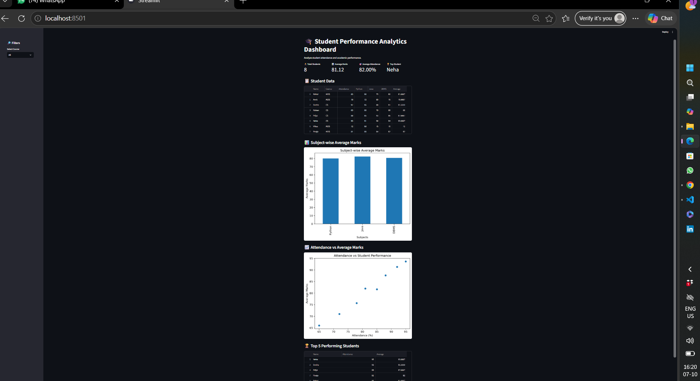

# 🎓 Student Performance Analytics Dashboard

An interactive Data Analytics dashboard built using Python, Pandas, Matplotlib, and Streamlit.

## 📌 Project Overview

This project analyzes student academic performance and attendance data.

The dashboard provides insights into:

- Total number of students
- Average marks
- Average attendance
- Top-performing student
- Subject-wise average marks
- Attendance vs student performance
- Top 5 performing students
- Course-based filtering

## 🛠️ Technologies Used

- Python
- Pandas
- Matplotlib
- Streamlit
- CSV

## 📊 Dashboard Features

### 1. Dashboard Metrics
Displays:
- Total Students
- Average Marks
- Average Attendance
- Top Student

### 2. Student Data
Displays complete student performance data in an interactive table.

### 3. Subject-wise Analysis
Shows average marks for:
- Python
- Java
- DBMS

### 4. Attendance vs Performance
A scatter plot shows the relationship between student attendance and average marks.

### 5. Top Performing Students
Displays the top 5 students based on average marks.

### 6. Course Filter
Allows users to filter the dashboard based on course.

## 📁 Project Structure

```text
Student Performance Analytics
│
├── app.py
├── students.csv
└── README.md

## ▶️ How to Run

Install the required libraries:

```bash
pip install pandas matplotlib streamlit

python -m streamlit run app.py

## 📸 Dashboard Preview



👨‍💻 Author
Deepak Nawale